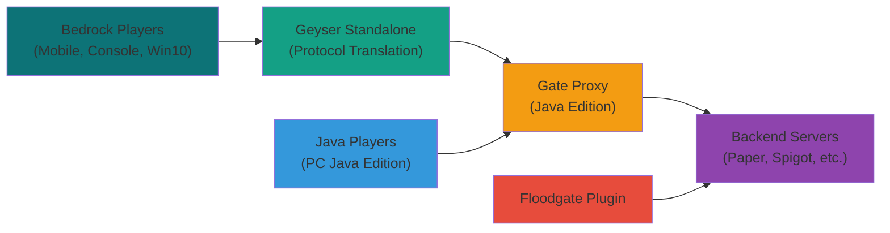

# Bedrock Edition Support

Gate provides comprehensive support for Minecraft Bedrock Edition players through integration with [Geyser](https://geysermc.org/) and [Floodgate](https://geysermc.org/download/?project=floodgate). This allows Bedrock players (mobile, console, Windows 10) to join your Java Edition servers.

## Architecture Overview

Gate's Bedrock support uses a proxy-in-front-of-proxy architecture where Geyser Standalone runs in front of Gate:



### How It Works

1. **Bedrock Players** connect to Geyser Standalone on UDP port 19132
2. **Geyser** translates Bedrock protocol to Java Edition protocol
3. **Gate** receives the translated connection and handles it like any Java player
4. **Floodgate** on backend servers authenticates Bedrock players without requiring Mojang accounts
5. **Java Players** connect directly to Gate as usual

## Quick Start with Docker Compose

The easiest way to get started is using our pre-configured Docker Compose setup:

::: code-group

```yaml [docker-compose.yml]
<!--@include: ../../../.examples/bedrock/docker-compose.yml -->
```

```yaml [gate.yml]
<!--@include: ../../../.examples/bedrock/gate.yml -->
```

```yaml [geyser/config.yml]
<!--@include: ../../../.examples/bedrock/geyser/config.yml -->
```

```yaml [geyser/floodgate.yml]
<!--@include: ../../../.examples/bedrock/geyser/floodgate.yml -->
```

```properties [server.properties]
<!--@include: ../../../.examples/bedrock/server.properties -->
```

:::

### Starting the Stack

```bash
# Clone the example
git clone https://github.com/minekube/gate.git
cd gate/.examples/bedrock

# Start all services
docker compose up -d

# View logs
docker compose logs -f
```

## Manual Setup

### Prerequisites

- [Gate Proxy](https://gate.minekube.com/guide/install/) installed and running
- [Geyser Standalone](https://geysermc.org/download/) downloaded
- [Floodgate](https://geysermc.org/download/?project=floodgate) plugin for your backend servers

### Step 1: Configure Gate

Enable Bedrock support in your Gate configuration:

::: code-group

```yaml [config.yml]
config:
  bind: 0.0.0.0:25565
  onlineMode: true
  servers:
    server1: localhost:25566
  try:
    - server1
  forwarding:
    mode: velocity
    velocitySecret: 'your-secret-key'

# Enable Bedrock edition support
editions:
  java:
    enabled: true
  bedrock:
    enabled: true
    config:
      # Geyser will connect to this address
      geyserListenAddr: '0.0.0.0:25567'
      # Username format for Bedrock players to avoid conflicts
      usernameFormat: '.%s'
      # Path to Floodgate key for authentication
      floodgateKeyPath: '/path/to/key.pem'
```

:::

### Step 2: Configure Geyser Standalone

::: code-group

```yaml [geyser/config.yml]
bedrock:
  port: 19132
  motd1: 'Gate + Geyser'
  motd2: 'Bedrock & Java Cross-Play'

remote:
  # Connect to Gate's Bedrock listener
  address: localhost
  port: 25567
  auth-type: floodgate
  use-proxy-protocol: true

# Point to the shared Floodgate key
floodgate-key-file: key.pem

# Enable passthrough for better integration
passthrough-motd: true
passthrough-player-counts: true
```

:::

### Step 3: Configure Backend Servers

Install Floodgate on your backend servers and configure them:

::: code-group

```properties [server.properties]
# Must be false when using Gate proxy
online-mode=false
# Required for Bedrock players
enforce-secure-profile=false
```

```yaml [plugins/floodgate/config.yml]
# Floodgate configuration
player-link:
  # Allow linking Bedrock accounts to Java accounts
  enabled: true
  # Require linking for certain features
  require-link: false

# Username prefix for Bedrock players
username-prefix: '.'

# Authentication settings
auth:
  # Use the same key as Geyser
  key-file-name: 'key.pem'
```

:::

### Step 4: Generate Floodgate Key

Generate a shared encryption key for Floodgate:

```bash
# Generate a 32-byte AES key for Floodgate
openssl rand -out key.pem 32

# Copy this key to all required locations:
# - Geyser Standalone directory
# - All backend servers' Floodgate directories
# - Gate's configured floodgateKeyPath

# Example locations:
cp key.pem /path/to/geyser/key.pem
cp key.pem /path/to/server1/plugins/floodgate/key.pem
cp key.pem /path/to/gate/floodgate.pem
```

### Step 5: Start the Services

Start each service in the correct order:

#### 1. Start Gate Proxy

```bash
# Start Gate with Bedrock support enabled
gate --config config.yml
```

You should see logs indicating Bedrock support is active:

```
INFO bedrock.geyser geyser/geyser.go:95 geyser integration started {"addr": "0.0.0.0:25567"}
INFO bedrock proxy/proxy.go:100 bedrock proxy started with geyser integration
INFO bedrock.geyser geyser/geyser.go:116 listening for geyser connections {"addr": "0.0.0.0:25567"}
```

#### 2. Start Backend Servers

Start your Paper/Spigot servers with Floodgate installed:

```bash
# Start your backend server (example for Paper)
cd /path/to/your/server
java -Xmx2G -jar paper-1.21.4.jar nogui
```

Ensure the server starts with Floodgate:

```
[INFO] [Floodgate] Floodgate has been enabled!
[INFO] [Floodgate] Loaded Floodgate key!
```

#### 3. Start Geyser Standalone

Download and start Geyser Standalone:

```bash
# Download Geyser Standalone (if not already downloaded)
wget https://download.geysermc.org/v2/projects/geyser/versions/latest/builds/latest/downloads/standalone -O geyser-standalone.jar

# Start Geyser Standalone
java -Xms1024M -jar geyser-standalone.jar
```

Geyser should connect to Gate and show:

```
[INFO] Started Geyser on 0.0.0.0:19132
[INFO] Connected to Java server on localhost:25567
[INFO] Floodgate enabled for this connection
```

### Startup Order Summary

1. **Gate** (with Bedrock support) - Starts first, listens on 25565 (Java) and 25567 (Geyser)
2. **Backend Servers** (with Floodgate) - Start second, connect to Gate
3. **Geyser Standalone** - Start last, connects to Gate's Bedrock listener

## Advanced Configuration

### Custom Username Formatting

Bedrock usernames can conflict with Java usernames. Configure formatting:

::: code-group

```yaml [config.yml]
editions:
  bedrock:
    config:
      # Prefix Bedrock usernames with a dot
      usernameFormat: '.%s'
      # Or use a different format
      # usernameFormat: "BE_%s"
      # usernameFormat: "%s_Mobile"
```

:::

### Network Security

::: warning Security Important
The Geyser listener address should be protected by a firewall to only allow connections from your Geyser instance. Direct connections to this port bypass Mojang authentication.
:::

Configure firewall rules:

```bash
# Allow only Geyser to connect to Gate's Bedrock listener
sudo ufw allow from GEYSER_IP to any port 25567
sudo ufw deny 25567
```

### Connect Integration

Gate's Bedrock support works seamlessly with [Connect](/guide/connect):

::: code-group

```yaml [config.yml]
connect:
  enabled: true
  name: my-crossplay-server
  allowOfflineModePlayers: true

editions:
  bedrock:
    enabled: true
    config:
      # Connect will handle the networking
      geyserListenAddr: '0.0.0.0:25567'
```

:::

## Troubleshooting

### Common Issues

::: details Bedrock Players Can't Connect

**Symptoms**:

- Bedrock players see "Unable to connect to world"
- Geyser logs show connection errors

**Solutions**:

1. **Check ports** - Ensure UDP 19132 is open for Bedrock clients
2. **Verify Geyser config** - Confirm `remote.address` points to Gate
3. **Test connectivity** - Use `telnet gate-ip 25567` to test Gate's Bedrock listener

:::

::: details Authentication Errors

**Symptoms**:

- "Failed to verify username" errors
- Players get kicked during login

**Solutions**:

1. **Check Floodgate key** - Ensure the same `key.pem` is used everywhere
2. **Verify permissions** - Make sure Gate can read the Floodgate key file
3. **Check username format** - Ensure no conflicts between Java and Bedrock usernames

:::

::: details Performance Issues

**Symptoms**:

- High latency for Bedrock players
- Server lag when Bedrock players join

**Solutions**:

1. **Optimize Geyser** - Adjust `compression-level` and `mtu` settings
2. **Resource allocation** - Ensure adequate RAM for protocol translation
3. **Network optimization** - Use `use-direct-connection: true` in Geyser config

:::

### Getting Help

If you encounter issues:

1. **Check logs** - Both Gate, Geyser, and server logs contain helpful information
2. **Verify versions** - Ensure compatibility between Gate, Geyser, and Floodgate versions
3. **Community support** - Join the [Gate Discord](https://minekube.com/discord) for help
4. **GitHub issues** - Report bugs with logs and reproduction steps

## Supported Features

### ✅ Working Features

- **Cross-play** - Java and Bedrock players on the same server
- **Authentication** - Floodgate handles Bedrock player authentication
- **Chat** - Full chat compatibility between editions
- **Commands** - Most commands work for both editions
- **Inventory** - Item synchronization between editions
- **World interaction** - Building, mining, crafting work normally

### ⚠️ Limited Features

- **Custom items** - Some Java-only items may not display correctly
- **Resource packs** - Bedrock resource packs require special handling
- **Some plugins** - Java-specific plugins may not work with Bedrock players

### ❌ Not Supported

- **Bedrock-only features** - Education Edition features, some UI elements
- **Java mods** - Forge/Fabric mods don't work with Bedrock players
- **Some advanced redstone** - Complex redstone may behave differently

---

_For more information about Geyser and Floodgate, visit the [GeyserMC Wiki](https://wiki.geysermc.org/)._
