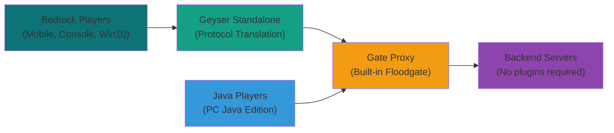

# Bedrock Edition Support

Gate provides comprehensive support for Minecraft Bedrock Edition players through integration with [Geyser](https://geysermc.org/) and built-in Floodgate protocol support. This allows Bedrock players (mobile, console, Windows 10) to join your Java Edition servers **without requiring any backend plugins**.

## Architecture Overview

Gate's Bedrock support uses a proxy-in-front-of-proxy architecture where Geyser Standalone runs in front of Gate:



### How It Works

1. **Bedrock Players** connect to Geyser Standalone on UDP port 19132
2. **Geyser** translates Bedrock protocol to Java Edition protocol and forwards to Gate
3. **Gate** receives the translated connection, handles Floodgate authentication, and forwards as a regular Java player
4. **Backend servers** receive normal Java Edition connections (no plugins required)
5. **Java Players** connect directly to Gate as usual

::: tip No Backend Plugins Required!
Unlike traditional Geyser setups, Gate has **built-in Floodgate protocol support**. Your backend servers (Paper, Spigot, etc.) don't need any plugins - they just see regular Java Edition players. Gate handles all the Bedrock authentication and data translation internally.
:::

## Quick Start (Recommended: Managed Mode)

The easiest way to get started is using Gate's **Managed Mode**, which automatically handles everything for you:

:::: code-group

```yaml [config.yml]
config:
  bind: 0.0.0.0:25565
  onlineMode: true
  servers:
    server1: localhost:25566
  try:
    - server1

  # Enable Bedrock with Managed Mode (Zero Configuration!)
  bedrock:
    enabled: true
    config:
      managed:
        enabled: true # This is all you need!
```

::::

**That's it!** Gate will automatically:

- ✅ **Generate Floodgate encryption key** (16-byte AES-128)
- ✅ **Download latest Geyser Standalone JAR** with proper timeouts and User-Agent
- ✅ **Create optimized Geyser configuration** that connects to Gate
- ✅ **Start and manage Geyser process** with visible logs, ready detection, and graceful shutdown
- ✅ **Smart updates** - Only downloads new Geyser versions when actually available (uses HTTP caching)

### Starting with Managed Mode

```bash
# Just start Gate - everything else is automatic!
gate --config config.yml
```

You'll see logs like:

```
INFO bedrock.managed generating floodgate key {"path": "floodgate.pem"}
INFO bedrock.managed floodgate key generated successfully {"path": "floodgate.pem"}
INFO bedrock.managed downloading geyser standalone {"url": "https://...", "path": ".geyser/geyser-standalone.jar"}
INFO bedrock.managed geyser jar downloaded successfully {"path": ".geyser/geyser-standalone.jar"}
INFO bedrock.managed starting geyser standalone process {"java": "java", "jar": "...", "config": "...", "bedrockPort": 19132}
[GEYSER] [INFO] Started Geyser on UDP port 19132
[GEYSER] [INFO] Connected to Java server on 0.0.0.0:25567
[GEYSER] [INFO] Floodgate enabled for this connection
```

**Connection Info:**

- **Java Players**: `localhost:25565`
- **Bedrock Players**: `localhost:19132`

## Advanced Managed Mode Configuration

You can customize managed mode if needed:

:::: code-group

```yaml [config.yml]
config:
  bedrock:
    enabled: true
    config:
      # Optional: Custom paths and settings
      geyserListenAddr: '0.0.0.0:25567'
      floodgateKeyPath: '/custom/path/key.pem'
      usernameFormat: '.%s'

      managed:
        enabled: true
        # Download URL for the Geyser Standalone JAR
        jarUrl: https://download.geysermc.org/v2/projects/geyser/versions/latest/builds/latest/downloads/standalone
        # Directory where the JAR and runtime data is stored
        dataDir: .geyser
        # Path to Java (defaults to 'java' on PATH)
        javaPath: java
        # UDP port for Bedrock clients
        bedrockPort: 19132
        # Update the JAR on startup if a new build is available (default: true)
        autoUpdate: true
        # Extra JVM/CLI args passed to the process
        extraArgs: ['-Xmx1G', '-XX:+UseG1GC']
        # Custom overrides for the auto-generated Geyser config
        configOverrides:
          bedrock:
            compression-level: 8
            motd1: 'Custom MOTD'
          debug-mode: true
          max-players: 500
```

::::

### Managed Mode Behavior

- **`autoUpdate: true` (default)**: Smart update check on startup - only downloads if a newer version is available (uses HTTP `Last-Modified`/`ETag` headers)
- **`autoUpdate: false`**: Only downloads if JAR is missing, skips update checks entirely
- **Auto-reload**: Restarts Geyser when relevant config changes (listen address, ports, etc.)
- **Graceful shutdown**: Stops Geyser process when Gate stops
- **Config overrides**: Deep merges user overrides into the auto-generated Geyser config

### Config Overrides Examples

You can override any Geyser configuration option:

:::: code-group

```yaml [Performance Tuning]
config:
  bedrock:
    config:
      managed:
        enabled: true
        configOverrides:
          bedrock:
            compression-level: 8
            mtu: 1200
          use-direct-connection: false
          disable-compression: false
```

```yaml [Custom Branding]
config:
  bedrock:
    config:
      managed:
        enabled: true
        configOverrides:
          bedrock:
            motd1: 'My Custom Server'
            motd2: 'Cross-Play Enabled'
            server-name: 'MyServer Bedrock'
          xbox-achievements-enabled: true
```

```yaml [Debug Mode]
config:
  bedrock:
    config:
      managed:
        enabled: true
        configOverrides:
          debug-mode: true
          log-player-ip-addresses: false
          notify-on-new-bedrock-update: false
```

::::

The overrides use **deep merging**, so you can override nested values like `bedrock.compression-level` without affecting other `bedrock.*` settings.

::: warning Manual Setup Only for Advanced Users
The manual setup below is only needed if you want to manage Geyser yourself or need custom configurations not supported by managed mode. **For most users, managed mode above is recommended.**
:::

## Alternative: Docker Compose

If you prefer containers, use our pre-configured Docker Compose setup:

:::: code-group

```yaml [docker-compose.yml]
<!--@include: ../../../.examples/bedrock/docker-compose.yml -->
```

```yaml [gate.yml]
<!--@include: ../../../.examples/bedrock/gate.yml -->
```

```yaml [geyser/config.yml]
<!--@include: ../../../.examples/bedrock/geyser/config.yml -->
```

```yaml [geyser/floodgate.yml]
<!--@include: ../../../.examples/bedrock/geyser/floodgate.yml -->
```

```properties [server.properties]
<!--@include: ../../../.examples/bedrock/server.properties -->
```

::::

### Starting the Stack

```bash
# Clone the example
git clone https://github.com/minekube/gate.git
cd gate/.examples/bedrock

# Start all services
docker compose up -d

# View logs
docker compose logs -f
```

## Manual Setup (Advanced)

::: tip Use Managed Mode Instead
**Most users should use Managed Mode above** for zero-configuration setup. This manual setup is for advanced users who need custom Geyser configurations.
:::

### Prerequisites

- [Gate Proxy](https://gate.minekube.com/guide/install/) installed and running
- [Geyser Standalone](https://geysermc.org/download/) downloaded
- [Floodgate](https://geysermc.org/download/?project=floodgate) plugin for your backend servers

### Step 1: Configure Gate

Enable Bedrock support in your Gate configuration:

:::: code-group

```yaml [config.yml]
config:
  bind: 0.0.0.0:25565
  onlineMode: true
  servers:
    server1: localhost:25566
  try:
    - server1
  forwarding:
    mode: velocity
    velocitySecret: 'your-secret-key'

  # Enable Bedrock edition support
  bedrock:
    enabled: true
    config:
      # Geyser will connect to this address
      geyserListenAddr: '0.0.0.0:25567'
      # Username format for Bedrock players to avoid conflicts
      usernameFormat: '.%s'
      # Path to Floodgate key for authentication
      floodgateKeyPath: '/path/to/key.pem'
```

::::

### Managed Mode Options

Gate's managed mode supports various customization options:

:::: code-group

```yaml [config.yml]
bedrock:
  enabled: true
  config:
    geyserListenAddr: '0.0.0.0:25567'
    floodgateKeyPath: '/path/to/key.pem'
    managed:
      enabled: true
      # Download URL for the Geyser Standalone JAR
      jarUrl: https://download.geysermc.org/v2/projects/geyser/versions/latest/builds/latest/downloads/standalone
      # Directory where the JAR and runtime data is stored
      dataDir: .geyser
      # Path to Java (defaults to 'java' on PATH)
      javaPath: java
      # UDP port for Bedrock clients
      bedrockPort: 19132
      # Update the JAR on startup if a new build is available
      autoUpdate: true
      # Extra JVM/CLI args passed to the process
      extraArgs: []
```

::::

When enabled, Gate will:

- Smart download: Check for and download newer Geyser Standalone JAR versions using HTTP caching headers (avoids unnecessary downloads).
- Start the process on Gate startup and stop it on shutdown/reload.
- Continue to listen on `geyserListenAddr` for the translated TCP connection from Geyser.

### Step 2: Configure Geyser Standalone

:::: code-group

```yaml [geyser/config.yml]
bedrock:
  port: 19132
  motd1: 'Gate + Geyser'
  motd2: 'Bedrock & Java Cross-Play'

remote:
  # Connect to Gate's Bedrock listener
  address: localhost
  port: 25567
  auth-type: floodgate
  use-proxy-protocol: true

# Point to the shared Floodgate key
floodgate-key-file: key.pem

# Enable passthrough for better integration
passthrough-motd: true
passthrough-player-counts: true
```

::::

### Step 3: Configure Backend Servers

Your backend servers need minimal configuration since Gate handles all Bedrock-specific logic:

:::: code-group

```properties [server.properties]
# Must be false when using Gate proxy
online-mode=false
# Required for Bedrock players (optional but recommended)
enforce-secure-profile=false
```

::::

::: tip No Floodgate Plugin Required!
Unlike traditional setups, you **don't need to install the Floodgate plugin** on your backend servers. Gate has built-in Floodgate protocol support and presents all players (Java and Bedrock) as regular Java Edition connections to your backend servers.
:::

### Step 4: Generate Floodgate Key

Generate a shared encryption key for Floodgate:

```bash
# Generate a 16-byte AES-128 key for Floodgate (matches Floodgate specification)
openssl rand -out key.pem 16

# Copy this key to required locations:
# - Geyser Standalone directory
# - Gate's configured floodgateKeyPath

# Example locations:
cp key.pem /path/to/geyser/key.pem
cp key.pem /path/to/gate/floodgate.pem
```

::: tip Managed Mode Auto-Generation
If you're using **Managed Mode** (recommended), you can skip this step entirely! Gate will automatically generate the Floodgate key for you.
:::

### Step 5: Start the Services

Start each service in the correct order:

#### 1. Start Gate Proxy

```bash
# Start Gate with Bedrock support enabled
gate --config config.yml
```

You should see logs indicating Bedrock support is active:

```
INFO bedrock.geyser geyser/geyser.go:95 geyser integration started {"addr": "0.0.0.0:25567"}
INFO bedrock proxy/proxy.go:100 bedrock proxy started with geyser integration
INFO bedrock.geyser geyser/geyser.go:116 listening for geyser connections {"addr": "0.0.0.0:25567"}
```

#### 2. Start Backend Servers

Start your Paper/Spigot servers with Floodgate installed:

```bash
# Start your backend server (example for Paper)
cd /path/to/your/server
java -Xmx2G -jar paper-1.21.4.jar nogui
```

Ensure the server starts with Floodgate:

```
[INFO] [Floodgate] Floodgate has been enabled!
[INFO] [Floodgate] Loaded Floodgate key!
```

#### 3. Start Geyser Standalone

Download and start Geyser Standalone:

```bash
# Download Geyser Standalone (if not already downloaded)
wget https://download.geysermc.org/v2/projects/geyser/versions/latest/builds/latest/downloads/standalone -O geyser-standalone.jar

# Start Geyser Standalone
java -Xms1024M -jar geyser-standalone.jar
```

Geyser should connect to Gate and show:

```
[INFO] Started Geyser on 0.0.0.0:19132
[INFO] Connected to Java server on localhost:25567
[INFO] Floodgate enabled for this connection
```

### Startup Order Summary

1. **Gate** (with Bedrock support) - Starts first, listens on 25565 (Java) and 25567 (Geyser)
2. **Backend Servers** (with Floodgate) - Start second, connect to Gate
3. **Geyser Standalone** - Start last, connects to Gate's Bedrock listener

## Advanced Configuration

### Custom Username Formatting

Bedrock usernames can conflict with Java usernames. Configure formatting:

:::: code-group

```yaml [config.yml]
bedrock:
  config:
    # Prefix Bedrock usernames with a dot
    usernameFormat: '.%s'
    # Or use a different format
    # usernameFormat: "BE_%s"
    # usernameFormat: "%s_Mobile"
```

::::

### Security

::: tip Keep Your Key Secure
The Geyser listener port uses AES-GCM encryption with the shared `key.pem` file for authentication. As long as you keep this key secure, the connection is cryptographically protected against spoofing and impersonation.

**Key Security Best Practices**:

- Set proper file permissions: `chmod 600 key.pem`
- Don't commit the key to version control: `echo "*.pem" >> .gitignore`
- In production, use secrets management (Docker secrets, Kubernetes secrets, etc.)
- Restrict network access to the Geyser listener port (recommended but not required)
  :::

Optional firewall protection:

```bash
# Only allow specific IPs to connect to Geyser listener
sudo ufw allow from GEYSER_IP to any port 25567
sudo ufw deny 25567
```

### Connect Integration

Gate's Bedrock support works seamlessly with [Connect](/guide/connect):

:::: code-group

```yaml [config.yml]
connect:
  enabled: true
  name: my-crossplay-server
  allowOfflineModePlayers: true

  bedrock:
    enabled: true
    config:
      # Connect will handle the networking
      geyserListenAddr: '0.0.0.0:25567'
```

::::

## Troubleshooting

### Common Issues

:::: details Bedrock Players Can't Connect

**Symptoms**:

- Bedrock players see "Unable to connect to world"
- Geyser logs show connection errors

**Solutions**:

1. **Check ports** - Ensure UDP 19132 is open for Bedrock clients
2. **Verify Geyser config** - Confirm `remote.address` points to Gate
3. **Test connectivity** - Use `telnet gate-ip 25567` to test Gate's Bedrock listener

::::

:::: details Authentication Errors

**Symptoms**:

- "Failed to verify username" errors
- Players get kicked during login

**Solutions**:

1. **Check Floodgate key** - Ensure the same `key.pem` is used everywhere
2. **Verify permissions** - Make sure Gate can read the Floodgate key file
3. **Check username format** - Ensure no conflicts between Java and Bedrock usernames

::::

:::: details Performance Issues

**Symptoms**:

- High latency for Bedrock players
- Server lag when Bedrock players join

**Solutions**:

1. **Optimize Geyser** - Adjust `compression-level` and `mtu` settings
2. **Resource allocation** - Ensure adequate RAM for protocol translation
3. **Network optimization** - Use `use-direct-connection: true` in Geyser config

::::

### Getting Help

If you encounter issues:

1. **Check logs** - Both Gate, Geyser, and server logs contain helpful information
2. **Verify versions** - Ensure compatibility between Gate, Geyser, and Floodgate versions
3. **Community support** - Join the [Gate Discord](https://minekube.com/discord) for help
4. **GitHub issues** - Report bugs with logs and reproduction steps

## Supported Features

### ✅ Working Features

- **Cross-play** - Java and Bedrock players on the same server
- **Authentication** - Floodgate handles Bedrock player authentication
- **Chat** - Full chat compatibility between editions
- **Commands** - Most commands work for both editions
- **Inventory** - Item synchronization between editions
- **World interaction** - Building, mining, crafting work normally

### ⚠️ Limited Features

- **Custom items** - Some Java-only items may not display correctly
- **Resource packs** - Bedrock resource packs require special handling
- **Some plugins** - Java-specific plugins may not work with Bedrock players

### ❌ Not Supported

- **Bedrock-only features** - Education Edition features, some UI elements
- **Java mods** - Forge/Fabric mods don't work with Bedrock players
- **Some advanced redstone** - Complex redstone may behave differently

---

_For more information about Geyser and Floodgate, visit the [GeyserMC Wiki](https://wiki.geysermc.org/)._
