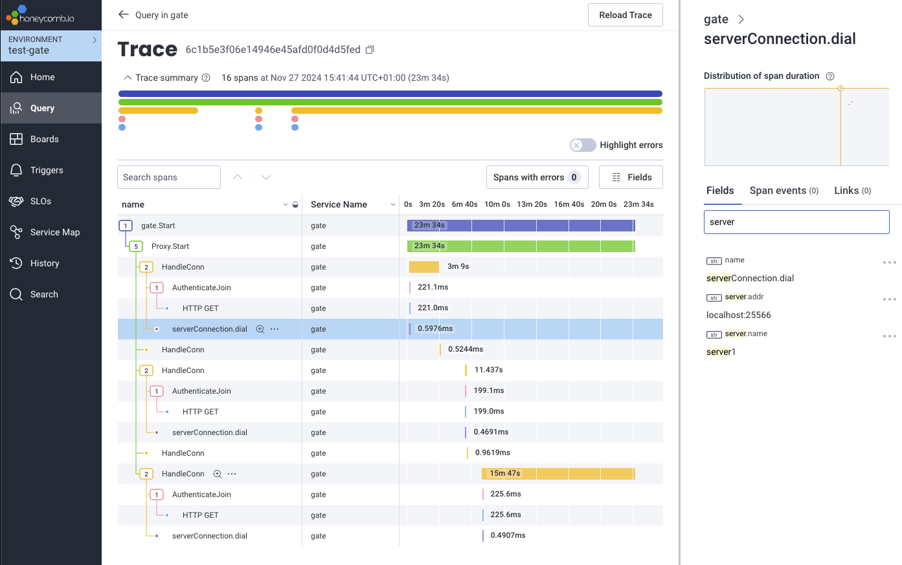
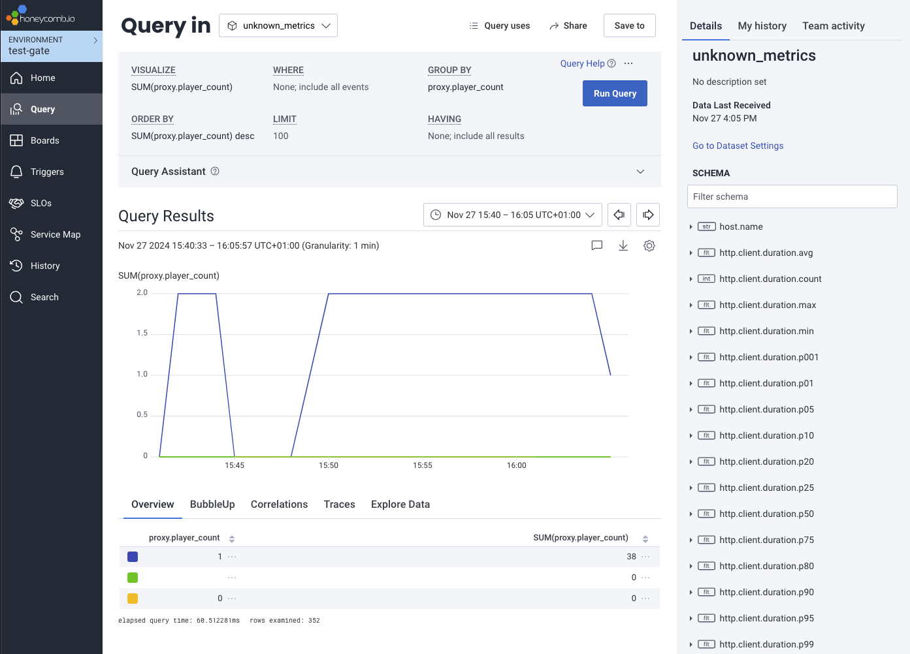

# Honeycomb

[Honeycomb](https://www.honeycomb.io/) is an OpenTelemetry-compatible observability platform that requires minimal setup - just sign up, create an environment, and get your API key to start collecting telemetry data. Here's how to get started:

1. **Create a Honeycomb Account**

   - Sign up at [Honeycomb.io](https://ui.honeycomb.io/signup)
   - Create a new environment (or use an existing one)
   - Get your API key from Environment Settings

2. **Configure Gate**

   Export the following environment variables before starting Gate:

   ::: code-group

   ```bash [US Region]
   export OTEL_EXPORTER_OTLP_ENDPOINT="https://api.honeycomb.io:443"
   export OTEL_EXPORTER_OTLP_HEADERS="x-honeycomb-team=your-api-key"
   ```

   ```bash [EU Region]
   export OTEL_EXPORTER_OTLP_ENDPOINT="https://api.eu1.honeycomb.io:443"
   export OTEL_EXPORTER_OTLP_HEADERS="x-honeycomb-team=your-api-key"
   ```

   :::

   ::: tip
   For production deployments, consider setting these environment variables in your system configuration or container orchestration platform rather than exporting them manually.
   :::

3. **Start Gate**

   Once the environment variables are set, start Gate normally. It will automatically begin sending telemetry data to Honeycomb.

   ```bash
   gate
   ```

   See [Install](/guide/install/) for more information on how to start Gate.

4. **View Your Data**

   Log into your Honeycomb account and navigate to your environment. You should see your Gate service appearing in the list of services, and you can start creating queries and visualizations to analyze your data.

   

   
