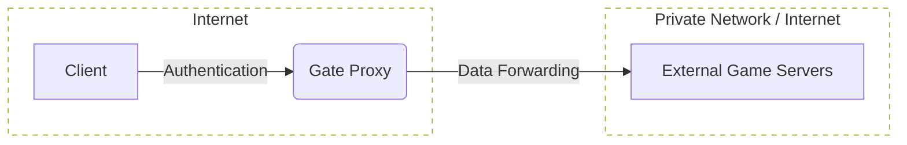
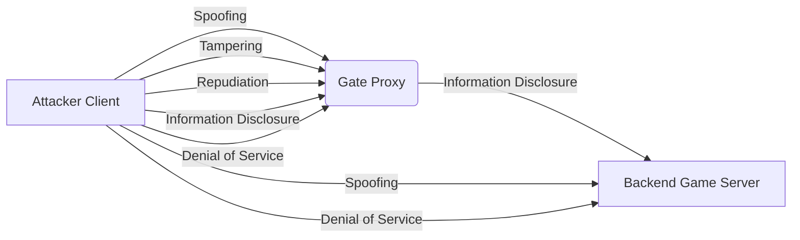
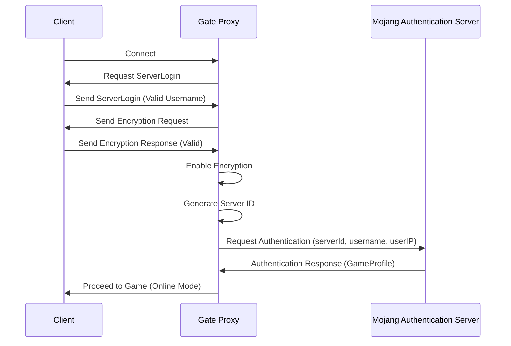

# Security considerations

Gate is a Minecraft reverse proxy that connects players to backend servers.
This means that the backend server might be exposed to the Internet if they listen on public IPs
and players could bypass your Gate instance without authentication.

To prevent this, you should configure your backend servers to only listen on private IPs and/or
use a firewall to only allow connections from your Gate instance. You can also enable modern
forwarding mode _(Velocity mode)_ with using a secret and PaperMC to prevent players from
connecting to your backend servers directly.

::: tip

This does not apply to [Lite mode](lite), where backend servers should do the authentication.

:::

## DDoS Protecting your Minecraft server

If you are running a high-profile public Minecraft server, and you are not using [Connect](https://connect.minekube.com),
having a good DDoS protection is essential to prevent your server from being taken offline.

If you are under attack, your server will be lagging, become unresponsive and timeout players.
This is not good for your player experience nor your brand.

There are many ways to protect your server from DDoS attacks.
Here are common methods proven to work very well in production:

### OVHcloud Anti-DDoS <VPBadge>cheap & reliable</VPBadge>

_OVH is a well known service provider that offers a very good
[DDoS protection](https://www.ovhcloud.com/en/security/anti-ddos/) service for your servers._

You don't need to host all your Minecraft servers on OVH, but you can set up
[Gate Lite](lite) on a tiny [VPS instance](https://www.ovhcloud.com/en/vps/) and
forward all your traffic to your backend servers.

::: details OVH Anti-DDoS setup

1. [Create a VPS instance](https://www.ovhcloud.com/en/vps/) _(any provider with good Anti-DDoS)_
2. [Install Gate](install/) on your VPS with [Lite mode](lite) enabled to point to your actual servers (not required)
3. [Activate Anti-DDoS](https://www.ovhcloud.com/en/security/anti-ddos/) in the OVH dashboard for your VPS
4. Configure your DNS to point your domain to your VPS IP address

:::

### Cloudflare Spectrum <VPBadge type='warning'>very costly</VPBadge>

Cloudlare is a well known service provider with global scale DDoS protection
for TCP services using [Cloudflare Spectrum](https://www.cloudflare.com/products/cloudflare-spectrum/minecraft/)

### TCPShield <VPBadge type='danger'>uses OVH</VPBadge>

TCPShield is a Minecraft proxy service that uses OVH's DDoS protection.
It is free for small servers.

---

# Minekube Gate Proxy: Cybersecurity Threats and Measures

- Code Repository: https://github.com/minekube/gate
- Website: https://gate.minekube.com/

# Introduction

This document presents the cybersecurity framework and measures implemented within the Minekube Gate Proxy System, which serves as an intermediary service between Minecraft players and game servers. It emphasizes the system's commitment to the core cybersecurity principles and outlines the architecture, threat models, and specific security measures in place.

## Security Framework

The Minekube Gate Proxy System is built upon a robust security framework that ensures:

- **Confidentiality**: Safeguarding player data privacy through encryption and controlled access.
- **Integrity**: Preserving data accuracy with packet validation and integrity checks.
- **Availability**: Maintaining reliable service access through connection management and failover strategies.
- **Accountability**: Enhancing incident response with structured logging and real-time monitoring.

## System Architecture and Security Components

The Minekube Gate Proxy System is designed with a security-focused architecture that integrates various components, each with specific roles and trust boundaries to ensure the secure operation of the service.

> A high-level overview for understanding the flow of data.

- **Player Authentication**: This component acts as the gatekeeper, verifying player identities using cryptographic methods to distinguish between untrusted public requests and trusted authenticated sessions. It ensures that only verified players can access the game network, mitigating the risk of spoofing attacks.
- **Data Forwarding and Connection Handler**: Responsible for managing the secure and accurate relay of data between players and external game servers. It operates within a trust boundary that safeguards the integrity and availability of connections, preventing tampering and ensuring reliable service access.
- **Logging Mechanism**: Meticulously records all transactions across trust boundaries, providing a reliable audit trail for security monitoring and incident analysis. This high-trust component enhances accountability and facilitates incident response.
- **Configuration Management**: Allows only authorized administrators to alter system configurations within a restricted-access, high-trust area. This component maintains the security and stability of the proxy environment, ensuring that the system operates within secure parameters.

## Threat Model Description

The STRIDE methodology helps in identifying potential security threats to the Minekube Gate Proxy System:

> The threat model diagram helps visualize the potential threats identified using the STRIDE methodology. It can show where in the system these threats could occur and the flow of potential attacks.

- **Spoofing**: There is a risk of attackers impersonating legitimate players to gain access to the server.
- **Tampering**: Game data could be altered in transit, affecting game integrity.
- **Repudiation**: Players might deny actions they have performed within the game, necessitating a reliable state machine.
- **Information Disclosure**: Exposure of sensitive information, such as player IP addresses, could lead to privacy breaches.
- **Denial of Service (DoS)**: The proxy service could be targeted with excessive traffic, aiming to disrupt its availability.
- **Elevation of Privilege**: There is a potential for attackers to gain unauthorized access to administrative functions or elevated privileges.

## Implemented Cyber Security Measures

To address the identified threats, the Minekube Gate Proxy System has implemented a range of controls:

- **Encryption**: Use of AES in CFB-8 mode encryption to encrypt data in transit, preventing eavesdropping and MitM attacks. ([ref](https://github.com/minekube/gate/blob/0b3b733dc3bdede11873fce5f52704ef2ec519cf/pkg/edition/java/proto/codec/cipher.go#L57))
    - The implementation utilizes the Advanced Encryption Standard (AES) in Cipher Feedback (CFB) mode with an 8-bit shift register, commonly referred to as CFB-8. AES is a symmetric key encryption algorithm, which means the same key is used for both encryption and decryption. CFB-8 is a mode of operation that allows block ciphers like AES to function as stream ciphers, processing data in smaller increments—in this case, 8 bits or 1 byte at a time.
    - This mode is particularly useful for encrypting data streams where the data's length may not be a multiple of the block size and where data needs to be processed byte-by-byte as it arrives. The CFB-8 mode achieves confidentiality by XORing each byte of the plaintext with an 8-bit segment of the encrypted previous ciphertext block (or the initialization vector for the first block). The initialization vector (IV) is a critical component that must be unique and unpredictable for each encryption session to ensure the security of the encryption scheme.
    
- **Rate Limiting and Quota Management**: Implementation of rate limiting to protect against DoS and DDoS attacks, and quota management to control the number of requests from a single source. (refs: [pkg](https://github.com/minekube/gate/blob/0b3b733dc3bdede11873fce5f52704ef2ec519cf/pkg/internal/addrquota/quota.go#L10), [connecting](https://github.com/minekube/gate/blob/0b3b733dc3bdede11873fce5f52704ef2ec519cf/pkg/edition/java/proxy/proxy.go#L476), [login](https://github.com/minekube/gate/blob/0b3b733dc3bdede11873fce5f52704ef2ec519cf/pkg/edition/java/proxy/session_handshake.go#L138))
    - The system enforces a consistent rate limit for events per second, allowing a specified number of requests from an IP address before imposing restrictions. This is crucial for mitigating the risk of service disruption due to excessive traffic from individual sources, which could be indicative of a DoS or DDoS attack.
    - A burst capacity is included to accommodate legitimate spikes in traffic, ensuring that users are not unduly restricted by the rate limiting mechanism during periods of high but legitimate usage.
    - The use of an LRU cache for storing rate limiters per IP address ensures efficient memory usage by retaining only the most recently accessed limiters, automatically purging the least active ones when the cache reaches its maximum capacity. This approach balances the need for active quota management with system resource constraints.
    - By grouping IP addresses with similar low-order bytes, the system can manage quotas for a range of IPs, reducing the granularity of control but improving performance and memory usage. This trade-off is often acceptable in scenarios where strict per-IP rate limiting is not required.
    
- **Authentication**: Ensuring secure client verification for online mode connections. ([ref](https://github.com/minekube/gate/blob/0b3b733dc3bdede11873fce5f52704ef2ec519cf/pkg/edition/java/auth/authenticator.go#L28))
    - The server employs RSA encryption to safeguard the exchange of sensitive data during the authentication process, crucial for preventing unauthorized access and man-in-the-middle attacks.
    - A server ID is generated using the decrypted shared secret and the server's public key, which, along with the player's username and optional IP address, is used to authenticate with Mojang's session server.
    - Rate limiting is implemented to protect against brute-force attacks and to prevent excessive requests to Mojang's API, which is an essential measure for maintaining the server's integrity and compliance with usage policies.
    

> The sequence diagram shows the best-case scenario for the online mode authentication flow. It can help in understanding the order of operations and the exchange of information between the client, proxy, and authentication server.

- **Packet Validation and Integrity Checks**: The system incorporates rigorous validation and integrity checks to ensure the authenticity and structure of packet data, which is essential for maintaining secure communication channels and preventing exploitation through packet manipulation. ([ref](https://github.com/minekube/gate/blob/0b3b733dc3bdede11873fce5f52704ef2ec519cf/pkg/edition/java/proto/codec/decoder.go#L204))
    - **Structural Validation**: The code enforces strict adherence to packet structure based on the Minecraft protocol version. This includes length checks for usernames and validation of cryptographic elements, such as public keys and signature holders, to ensure they conform to expected parameters.
    - **Data Integrity**: By validating the presence and correctness of packet fields, such as the `ServerLogin` packet's username and the `EncryptionRequest` packet's public key, the system mitigates risks associated with data corruption or tampering that could lead to security breaches. ([ref](https://github.com/minekube/gate/blob/0b3b733dc3bdede11873fce5f52704ef2ec519cf/pkg/edition/java/proto/packet/login.go#L74))
    - **Protocol Compliance**: The system checks that packets are consistent with the protocol version in use. ([ref](https://github.com/minekube/gate/blob/0b3b733dc3bdede11873fce5f52704ef2ec519cf/pkg/edition/java/proto/state/registry.go#L12))
    - **Error Detection**: Custom error handling, including silent errors, allows the system to gracefully manage unexpected or anomalous packet data.

- **Configuration Best Practices**: Adherence to security best practices for system configuration.
    - **Validation**: Configuration validation is essential for maintaining the security and operational stability of a proxy server. It prevents misconfigurations that could lead to vulnerabilities, ensuring the system operates within secure parameters and can handle expected traffic loads efficiently. ([ref](https://github.com/minekube/gate/blob/0b3b733dc3bdede11873fce5f52704ef2ec519cf/pkg/edition/java/config/config.go#L168))
    - **Risk Management**: By proactively warning users of insecure settings in the console, the system minimizes risks, reduces its attack surface, and builds user trust through demonstrated commitment to security.

- **Proxy Protocol Support**: Support for the HAProxy PROXY protocol to preserve client IP addresses securely.
    - **Enhanced Backend Server Security**: By maintaining the integrity of client IP information, backend servers can utilize accurate IP data for security measures such as logging, rate limiting, and banning malicious users. This support is crucial for traceability and accountability in user actions, contributing to a more secure and manageable server environment. (refs: [backend](https://github.com/minekube/gate/blob/0b3b733dc3bdede11873fce5f52704ef2ec519cf/pkg/edition/java/proxy/server.go#L367), [client](https://github.com/minekube/gate/blob/0b3b733dc3bdede11873fce5f52704ef2ec519cf/pkg/edition/java/proxy/proxy.go#L466))

- **Connection Management**: Secure management of client connections, including proper session handling and timeout configurations.
    - **Robust Session Integrity**: The project ensures that each client connection is securely managed with a unique session, preventing unauthorized access and session hijacking. This is critical for maintaining user security throughout their interaction with the proxy. ([ref](https://github.com/minekube/gate/blob/0b3b733dc3bdede11873fce5f52704ef2ec519cf/pkg/edition/java/proxy/session_auth.go#L80))
    - **Configurable Timeouts**: With customizable connection and read timeout settings, the system can close inactive sessions and free up resources, which helps in mitigating potential denial-of-service attacks by dropping stale or malicious connections. (refs: [read](https://github.com/minekube/gate/blob/0b3b733dc3bdede11873fce5f52704ef2ec519cf/pkg/edition/java/netmc/reader.go#L56C16-L56C16), [write](https://github.com/minekube/gate/blob/0b3b733dc3bdede11873fce5f52704ef2ec519cf/pkg/edition/java/netmc/writer.go#L52))
    - **Failover Mechanisms**: The proxy's ability to failover on unexpected server disconnects ensures continuous service availability and resilience, which is vital for maintaining a reliable connection infrastructure. ([ref](https://github.com/minekube/gate/blob/0b3b733dc3bdede11873fce5f52704ef2ec519cf/pkg/edition/java/proxy/session_backend_play.go#L112))
        - **Load Distribution**: Failover serves as load balancing, spreading out player connections to prevent server overload and improve performance.
        - **User Experience**: The mechanism minimizes disruptions during server crashes or maintenance, keeping players engaged. ([ref](https://github.com/minekube/gate/blob/0b3b733dc3bdede11873fce5f52704ef2ec519cf/pkg/edition/java/proxy/switch.go#L201))
        - **Service Resilience**: Failover contributes to service reliability, facilitating backend operations without complete service interruptions.
    
- **Logging and Monitoring**: Comprehensive logging of system events for monitoring and auditing purposes, and real-time monitoring to detect and respond to potential security incidents.
    - **Structured Leveled Logging**: Implementation of a logging system that categorizes logs into different severity levels to facilitate easier analysis and troubleshooting. ([ref](https://github.com/minekube/gate/blob/0b3b733dc3bdede11873fce5f52704ef2ec519cf/cmd/gate/root.go#L129))
    - **Debug Mode**: Capability to enable a verbose debug mode in real-time through the auto-reloading configuration file, allowing for in-depth data collection during urgent investigative scenarios without requiring system restarts. ([ref](https://github.com/minekube/gate/blob/0b3b733dc3bdede11873fce5f52704ef2ec519cf/pkg/gate/gate.go#L252))

## Conclusion

In conclusion, the Minekube Gate Proxy System incorporates a comprehensive cybersecurity framework that aligns with the principles of confidentiality, integrity, availability, and accountability. Operators are liable for running the system. The security measures detailed in this document reflect the commitment to protecting the system against a spectrum of cyber threats.