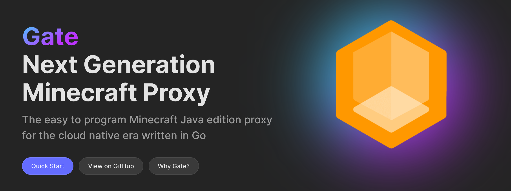
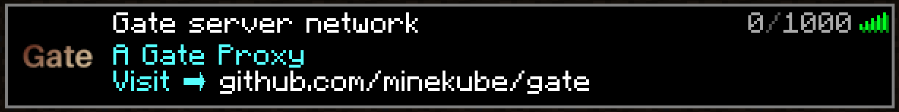
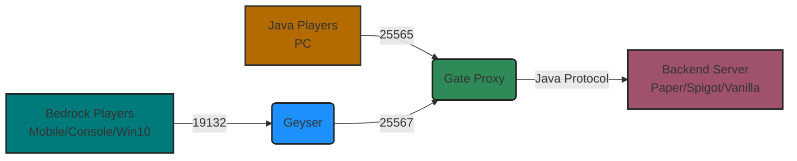
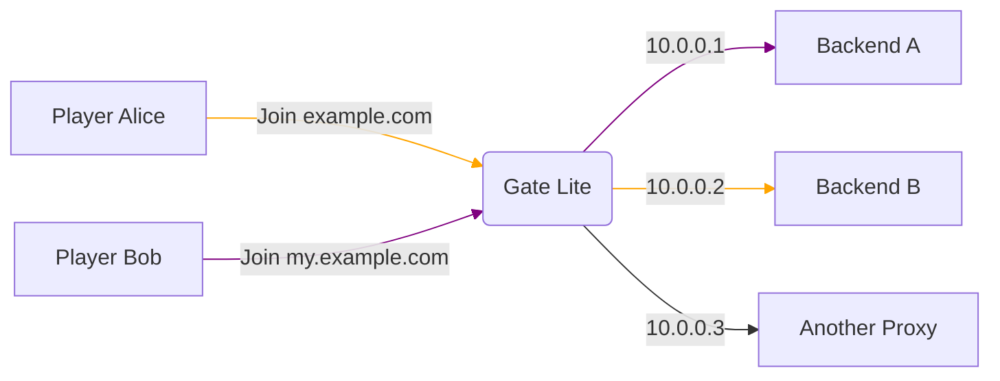

# The extensible Minecraft Proxy

**Gate is an extensible, high performant & paralleled
Minecraft proxy** server with scalability, flexibility,
cross-platform compatibility & excellent server version support -
_written in Go and ready for the cloud!_

## [Website & Documentation](https://gate.minekube.com)

**There is a lot to discover on Gate's website.**
Please refer to the website for the [documentation](https://gate.minekube.com),
guides and any more information needed!

## Quick Start

Follow our [quick start guide](https://gate.minekube.com/guide/quick-start/) on creating a simple Minecraft network!

| Platform    | Installation Command                                               |
| ----------- | ------------------------------------------------------------------ |
| Go          | `go run go.minekube.com/gate@latest`                               |
| Linux/macOS | `curl -fsSL https://gate.minekube.com/install \| bash`             |
| Windows     | `powershell -c "irm https://gate.minekube.com/install.ps1 \| iex"` |

## Bedrock Cross-Play Support

Gate includes built-in **Bedrock Edition support** enabling cross-play between
Java Edition (PC) and Bedrock Edition (Mobile, Console, Windows 10) players
through integrated Geyser & Floodgate technology - **zero plugins required**!

See the [Bedrock Guide](https://gate.minekube.com/guide/bedrock/) for setup instructions.

## Gate Lite Mode

Gate has a Lite Mode which is a lightweight version of Gate that can expose
multiple Minecraft servers through a single port and IP address and reverse proxy
players to backend servers based on the hostname/subdomain they join with.

See the [Lite Mode](https://gate.minekube.com/guide/lite/) guide for more information.

## Developers Starter Template

The starter template is designed to help you get started with your own Gate powered project.
Fork it! 🚀 - [minekube/gate-plugin-template](https://github.com/minekube/gate-plugin-template)
