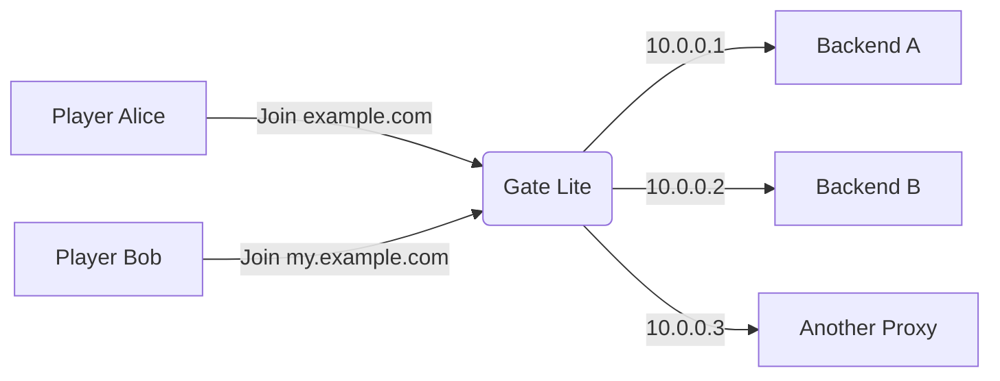

# The extensible Minecraft Proxy

**Gate is an extensible, high performant & paralleled
Minecraft proxy** server with scalability, flexibility &
excellent server version support -
_written in Go and ready for the cloud!_

> Gate is currently subject to have breaking changes,
> but you can already start using it!
> It is already being used by our wide [community](https://minekube.com/discord) and powers the open [Connect Network](https://connect.minekube.com/)!

## [Website & Documentation](https://gate.minekube.com)

**There is a lot to discover on Gate's website.**
Please refer to the website for the [documentation](https://gate.minekube.com),
guides and any more information needed!

## Quick Start

Follow our [quick start guide](https://gate.minekube.com/guide/quick-start/) on creating a simple Minecraft network!

## Gate Lite Mode

Gate has a Lite Mode which is a lightweight version of Gate that can expose
multiple Minecraft servers through a single port and IP address and reverse proxy
players to backend servers based on the hostname/subdomain they join with.

See the [Lite Mode](https://gate.minekube.com/guide/lite/) guide for more information.

