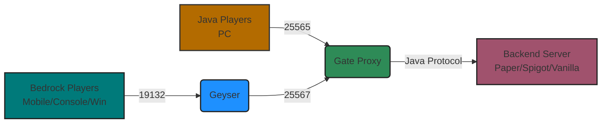

**Gate-debloated is an extensible, high performant & paralleled
Minecraft proxy** server with scalability, flexibility,
cross-platform compatibility & excellent server version support -
_written in Go and ready for the cloud!_


## Why Gate-debloated?

This is a debloated fork of the original Gate project. The changes include:
- **Removal of Freemium Features**: Cleaned up code related to premium services.
- **Removed Connect Integration**: The `Connect` tunneling features have been completely removed.
- **Simplified Configuration**: Refactored the project to exclusively use a full configuration, removing the `lite`, `minimal`, and `simple` configuration variations.

## Quick Start

Follow the [quick start guide](https://need-to-be-done) on creating a simple Minecraft network!


## Bedrock Cross-Play Support

Gate-Debloated includes built-in **Bedrock Edition support** through Geyser enabling cross-play between
Java Edition (PC) and Bedrock Edition (Mobile, Console, Windows) players
through integrated Geyser & Floodgate technology (**Floodgate required on the backend**)!

Enable managed Bedrock support with one config line:

```yaml
bedrock: true
```

See the [Bedrock Guide](https://need-to-be-done/) for setup instructions.


```mermaid
graph LR
    A[Java Players<br/>PC] -->|25565| D(Gate Proxy)
    B[Bedrock Players<br/>Mobile/Console/Win] -->|19132| C(Geyser)
    C -->|25567| D
    D -->|Java Protocol| E[Backend Server<br/>Paper/Spigot/Vanilla]

    style A fill:#b36b00,stroke:#333,stroke-width:2px
    style B fill:#007a7a,stroke:#222,stroke-width:2px
    style C fill:#1e90ff,stroke:#222,stroke-width:2px
    style D fill:#2e8b57,stroke:#222,stroke-width:2px
    style E fill:#a0526d,stroke:#222,stroke-width:2px
```

## Java Version Compatibility

Gate can start **Via-powered backend protocol translation** through managed
vialite, so Java clients can join configured or API-registered backend servers
running different Minecraft versions without running a separate Via sidecar.

Enable managed Via in classic proxy mode with:

```yaml
config:
  via:
    enabled: true
```

Gate starts the native vialite subprocess, resolves the latest stable vialite
release automatically, downloads the checksummed artifact into the local cache,
and routes backend connections through it. Dynamic backends registered through
Gate's Go API are added to vialite at runtime, which lets session
backends use the same version compatibility path as static config servers. Exact
release pins, offline mode, and local artifact paths remain available for
controlled deployments, but no manual version setting is required for the
default path. Dynamic API-registered backend translation uses the default
subprocess mode; embedded mode is limited to configured servers.